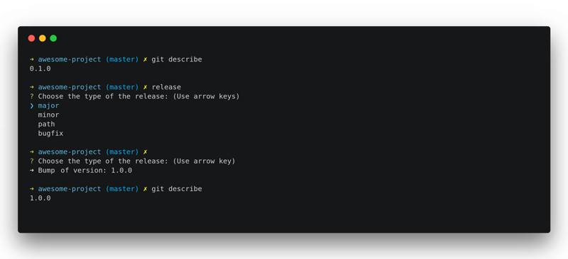

# Release Tag

[](https://travis-ci.org/jeffersondanielss/release-tag)
[](https://codeclimate.com/github/jeffersondanielss/release-tag/maintainability)
[](https://codeclimate.com/github/jeffersondanielss/release-tag/test_coverage)

<center>
  
</center>

## What is it?
Updating the project tag based on the type of change.

- Major, Big changes in the API (1.0.0)
- Minor, Adding features (0.1.0)
- Path, Bug fixes (0.0.1)
- Dev, Development versions (0.0.0.1.bug)

## How install?

Install Globally
```bash
$ npm i -g release-tag
```

## how use

```bash
$ release-tag
```

## Run tests

```bash
$ yarn test
```
